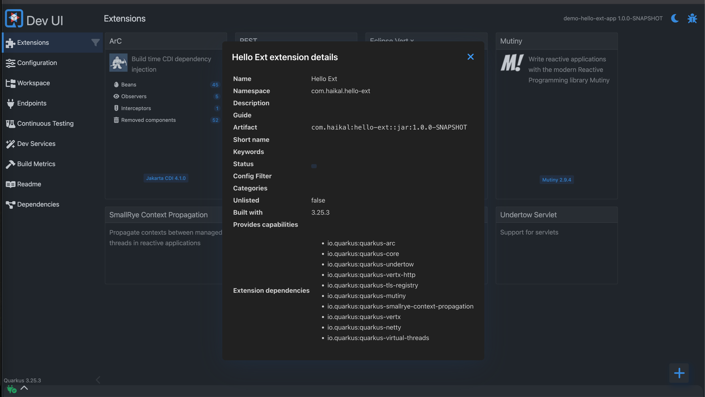
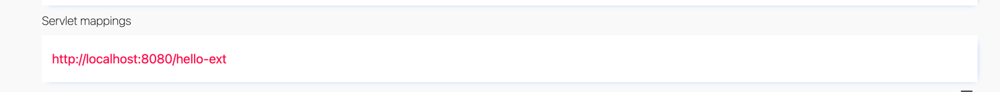

# Quarkus Extension Development Example | Exemplo de Desenvolvimento de Extensão Quarkus

[English](#english) | [Português](#português)

## English

This project demonstrates how to create a basic Quarkus extension that integrates with the Quarkus Dev UI. It serves as a practical example for developers who want to learn how to extend Quarkus functionality.

### What This Project Shows

- How to create a basic Quarkus extension structure
- How to implement a simple servlet in the runtime module
- How to register the extension in the deployment module
- How the extension appears in the Quarkus Dev UI

### Step-by-Step Guides

This repository includes step-by-step guides to help you understand the extension development process:

- [Step 0: Initial Setup](README.step.0-initial.md) - Creating the extension skeleton and implementing a basic servlet
- [Step 1: Properties Configuration](README.step.1-properties.md) - Adding configuration properties to the extension

### Dev UI Integration

One of the key features demonstrated in this project is how a Quarkus extension integrates with the Dev UI. When you run an application that includes this extension, you'll see it appear in the Dev UI:



The extension also registers a servlet that can be viewed in the Dev UI:



### Git Integration

This repository is structured to help you understand the development process of a Quarkus extension. You can:

1. Clone this repository to explore the code:
   ```bash
   git clone https://github.com/yourusername/hello-ext.git
   cd hello-ext
   ```

2. Build and install the extension locally:
   ```bash
   mvn -q -DskipTests install
   ```

3. Create a test application and add the extension as a dependency:
   ```xml
   <dependency>
     <groupId>com.haikal</groupId>
     <artifactId>hello-ext</artifactId>
     <version>1.0.0-SNAPSHOT</version>
   </dependency>
   ```

4. Run the test application and access the extension:
   ```bash
   ./mvnw quarkus:dev
   curl http://localhost:8080/hello-ext          
   ```

### Project Structure

The extension consists of two main modules:

- **runtime**: Contains the code that runs in the application (HelloServlet)
- **deployment**: Contains the build steps that integrate your feature into Quarkus during build time

### Contributing

Feel free to fork this repository and use it as a starting point for your own Quarkus extensions. If you have improvements or suggestions, pull requests are welcome!

### References

For more information about Quarkus extension development, check out these official resources:

- [Building my first extension](https://quarkus.io/guides/building-my-first-extension)
- [Writing Your Own Extension](https://quarkus.io/guides/writing-extensions)
- [Extension Capabilities](https://quarkus.io/guides/capabilities)

## Português

Este projeto demonstra como criar uma extensão básica do Quarkus que se integra com a Dev UI do Quarkus. Serve como um exemplo prático para desenvolvedores que desejam aprender como estender a funcionalidade do Quarkus.

### O Que Este Projeto Mostra

- Como criar uma estrutura básica de extensão Quarkus
- Como implementar um servlet simples no módulo runtime
- Como registrar a extensão no módulo deployment
- Como a extensão aparece na Dev UI do Quarkus

### Guias Passo a Passo

Este repositório inclui guias passo a passo para ajudar você a entender o processo de desenvolvimento de extensões:

- [Passo 0: Configuração Inicial](README.step.0-initial.md) - Criando o esqueleto da extensão e implementando um servlet básico
- [Passo 1: Configuração de Propriedades](README.step.1-properties.md) - Adicionando propriedades de configuração à extensão

### Integração com a Dev UI

Uma das principais características demonstradas neste projeto é como uma extensão Quarkus se integra com a Dev UI. Quando você executa uma aplicação que inclui esta extensão, você a verá aparecer na Dev UI:


A extensão também registra um servlet que pode ser visualizado na Dev UI:


### Integração com Git

Este repositório é estruturado para ajudar você a entender o processo de desenvolvimento de uma extensão Quarkus. Você pode:

1. Clonar este repositório para explorar o código:
   ```bash
   git clone https://github.com/yourusername/hello-ext.git
   cd hello-ext
   ```

2. Construir e instalar a extensão localmente:
   ```bash
   mvn -q -DskipTests install
   ```

3. Criar uma aplicação de teste e adicionar a extensão como dependência:
   ```xml
   <dependency>
     <groupId>com.haikal</groupId>
     <artifactId>hello-ext</artifactId>
     <version>1.0.0-SNAPSHOT</version>
   </dependency>
   ```

4. Executar a aplicação de teste e acessar a extensão:
   ```bash
   ./mvnw quarkus:dev
   curl http://localhost:8080/hello-ext           
   ```

### Estrutura do Projeto

A extensão consiste em dois módulos principais:

- **runtime**: Contém o código que é executado na aplicação (HelloServlet)
- **deployment**: Contém os build steps que integram sua funcionalidade ao Quarkus durante o tempo de build

### Contribuindo

Sinta-se à vontade para fazer fork deste repositório e usá-lo como ponto de partida para suas próprias extensões Quarkus. Se você tiver melhorias ou sugestões, pull requests são bem-vindos!

### Referências

Para mais informações sobre o desenvolvimento de extensões Quarkus, confira estes recursos oficiais:

- [Construindo minha primeira extensão](https://quarkus.io/guides/building-my-first-extension)
- [Escrevendo Sua Própria Extensão](https://quarkus.io/guides/writing-extensions)
- [Capacidades de Extensão](https://quarkus.io/guides/capabilities)
